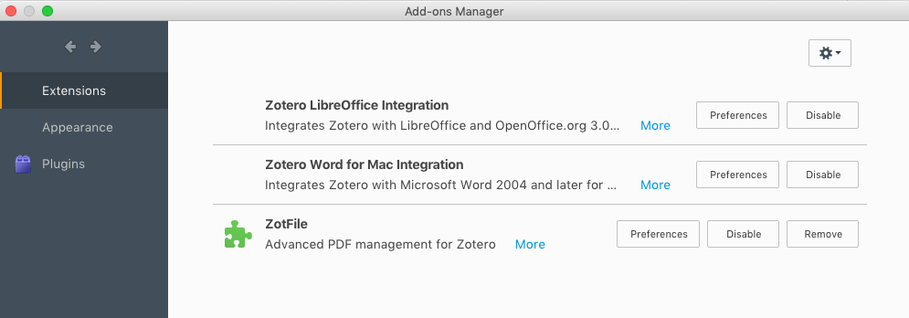
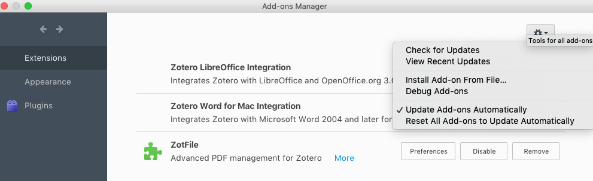
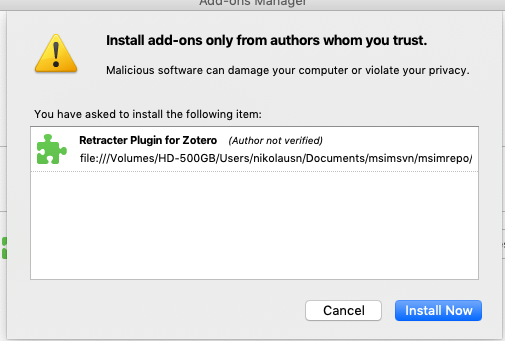
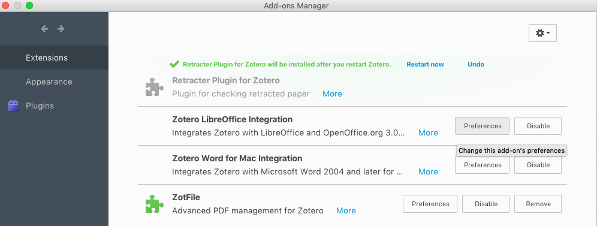
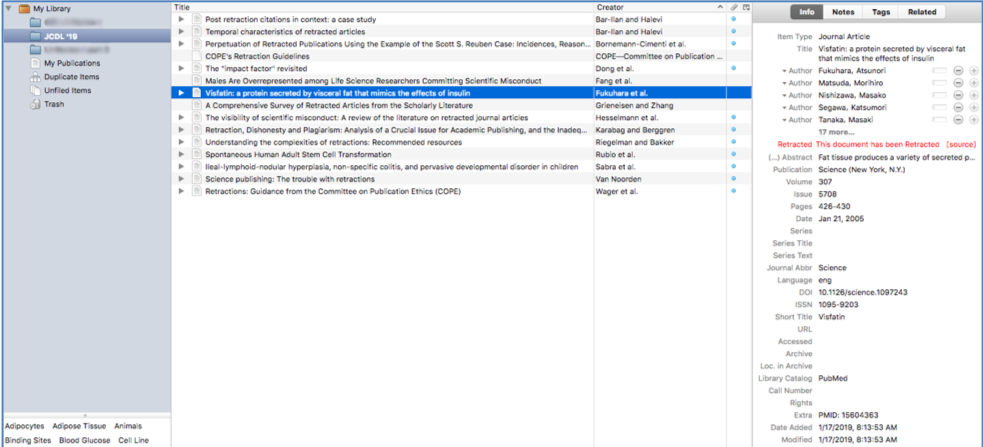
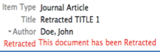

# ReTrackers

Retrackers is a zotero plugin for tracking retracted paper.

The Plugin is still under development and we are still improving and testing different approaches on improving the idea to give information about retracted paper to the user.

To install the plugin, zotero user can download the xpi in this github directory:
https://github.com/nikolausn/ReTrackers/blob/master/release/zotero-retrackers-1.0.2.xpi?raw=true

After that zotero user install directly from the zotero application by choosing menu Tools->Add Ons and then choose Install Add Ons from file described in these steps below:

 

 

 

 

 Once the retracker installed, the plugin will check the title in the user library matched with the retracker database.
 If the plugin found retracted paper, it will add retracted information in the info pane list:

 
 

Acknowledgements:
- This plugin adapted from the Zotero helloword sample:
https://github.com/zotero/zotero-hello-world
- Thanks to the Zotero Developer. API used in this plugin based on the Zotero
https://github.com/zotero/zotero
- Thanks to the Mozilla Developer, and developer framework.
https://developer.mozilla.org/en-US/docs/Mozilla/Developer_guide

